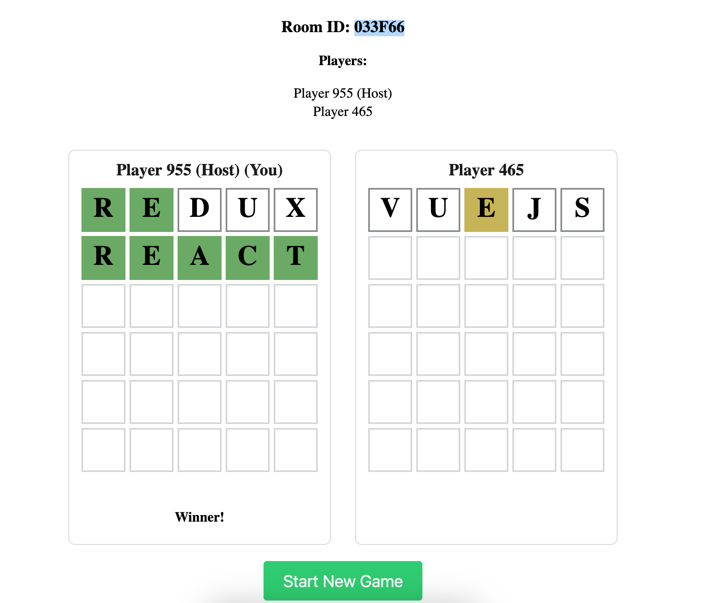

# Multiplayer Wordle

A real-time multiplayer version of the popular word-guessing game Wordle, built with React, TypeScript, Socket.IO, and Node.js.

## Demo


### Server Setup

1. Clone the repository
   ```
   git clone https://github.com/yourusername/multiplayer-wordle.git
   ```

2. Navigate to the server directory
   ```
   cd server
   ```

3. Install dependencies
   ```
   npm install
   ```

4. Start the server
   ```
   npm run dev
   ```

### Client Setup

1. Navigate to the client directory
   ```
   cd client
   ```

2. Install dependencies
   ```
   npm install
   ```

3. Start the development server
   ```
   npm start
   ```

The client will be available at `http://localhost:3000`
